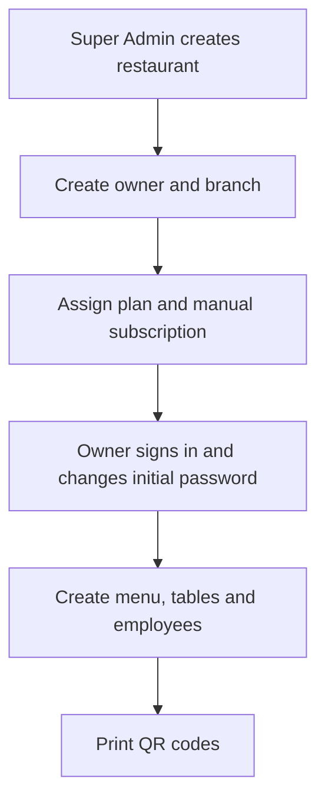
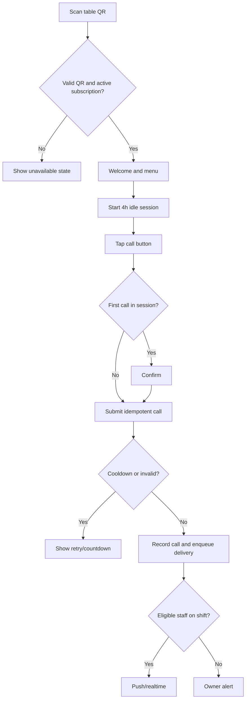
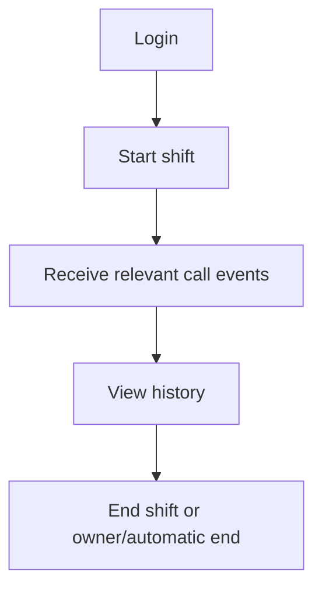
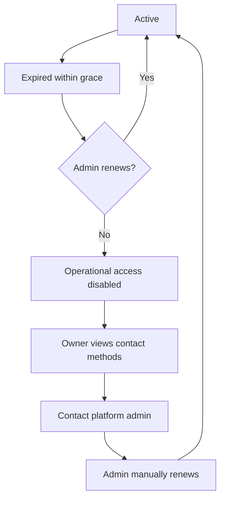

# User flows — Mermaid
## Restaurant onboarding

```mermaid
flowchart TD
 A[Super Admin creates restaurant] --> B[Create owner and branch]
 B --> C[Assign plan and manual subscription]
 C --> D[Owner signs in and changes initial password]
 D --> E[Create menu, tables and employees]
 E --> F[Print QR codes]
```
## Customer

```mermaid
flowchart TD
 A[Scan table QR] --> B{Valid QR and active subscription?}
 B -- No --> X[Show unavailable state]
 B -- Yes --> C[Welcome and menu]
 C --> D[Start 4h idle session]
 D --> E[Tap call button]
 E --> F{First call in session?}
 F -- Yes --> G[Confirm]
 F -- No --> H[Submit idempotent call]
 G --> H
 H --> I{Cooldown or invalid?}
 I -- Yes --> J[Show retry/countdown]
 I -- No --> K[Record call and enqueue delivery]
 K --> L{Eligible staff on shift?}
 L -- Yes --> M[Push/realtime]
 L -- No --> N[Owner alert]
```
## Employee

```mermaid
flowchart TD
 A[Login] --> B[Start shift]
 B --> C[Receive relevant call events]
 C --> D[View history]
 D --> E[End shift or owner/automatic end]
```
## Subscription

```mermaid
flowchart TD
 A[Active] --> B[Expired within grace]
 B --> C{Admin renews?}
 C -- Yes --> A
 C -- No --> D[Operational access disabled]
 D --> E[Owner views contact methods]
 E --> F[Contact platform admin]
 F --> G[Admin manually renews]
 G --> A
```
